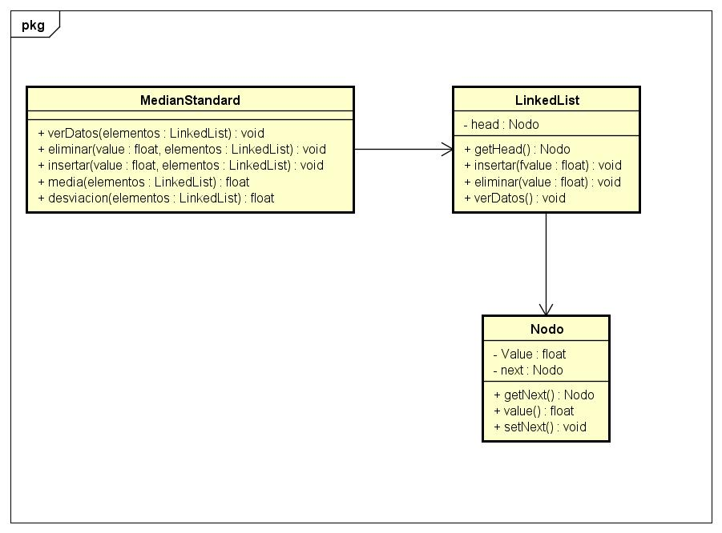
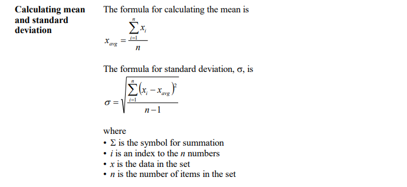
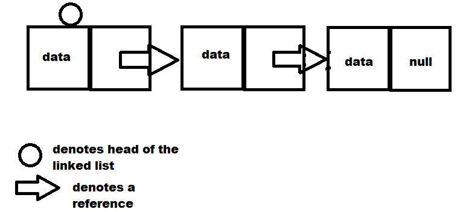

# Mean and Standard Deviation using Linked Lists  
# Author : David Daniel A. Ramirez Moreno
## Architecture
  
on the following image we can make a break down of the architecture presented on the project.  
as we can see we have 3 classes, linked List, Node And MedianStandard
### MedianStandard
this class consist of the methods that allow us to calculate the mean and the standard deviation on the project this method receive as parameter the linked list from wich we are going to extract the data and make the calculations needed.  
the mean and standard deviation formulas are the following:  
  
### LinkedList
this class is focused on the management of the data using Node class wich will be explained later. with this class we can do the following operations to manage the data:  
1. insert a value, this will create a Node and insert it on the tail of the linkedList.
2. delete a value, this will find the first matching value with the data given an remove it from the LinkedList.
3. check the data of the linked list, this will allow to navigate through the linked list and retreive the data it contains.  

### Node
 the node is the simplest class of the project, it contains the value it is saving and a reference to the next node in order to navigate through them.  

 here is an example of the linked list we are working on where we can found how it and the node works:  
  

### Running the project
to run the project you must execute the following commands on the root folder:  
> mvn package  

and then:  
> mvn exec:java -Dexec.mainClass="edu.escuelaing.arep.MedianStandard"  
### Javadocs
the javadocs can be found in the folder :  
> Javadocs

